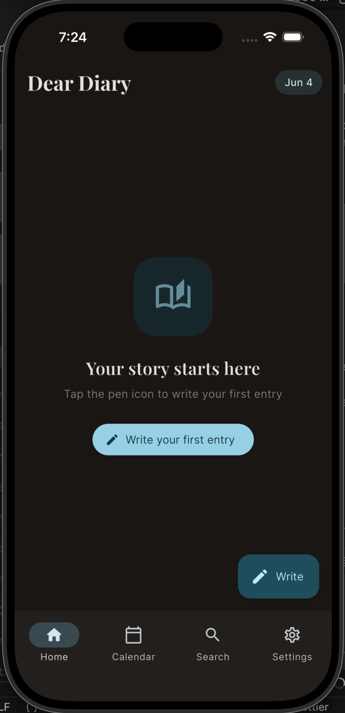
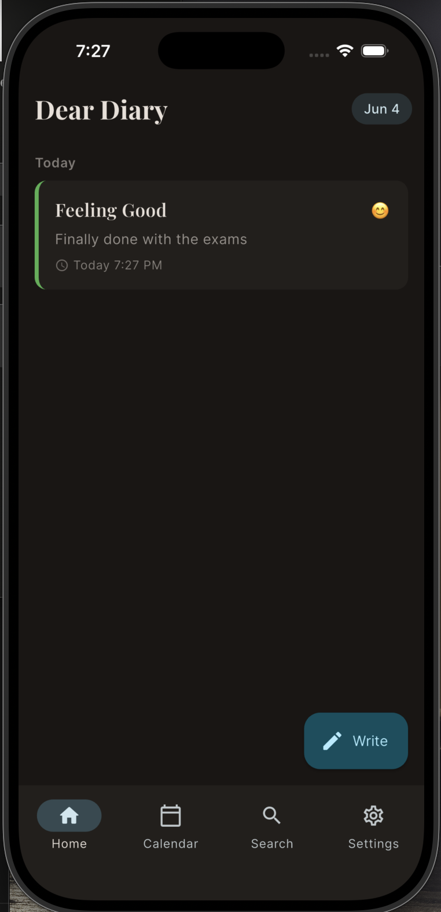
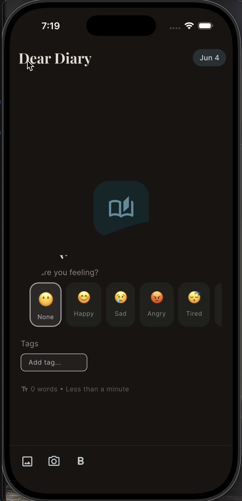
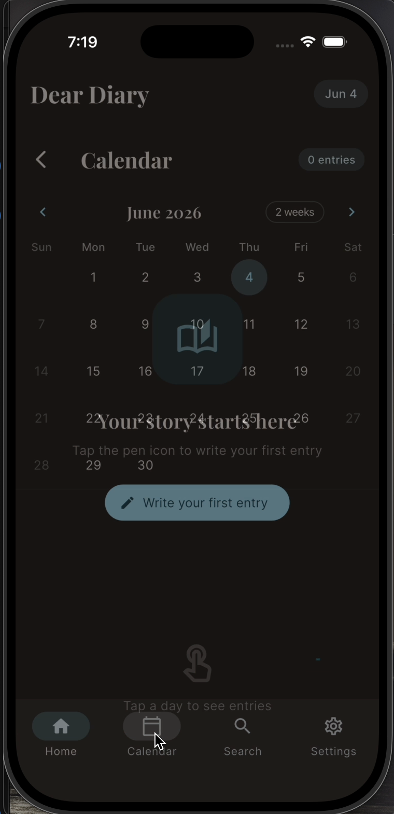
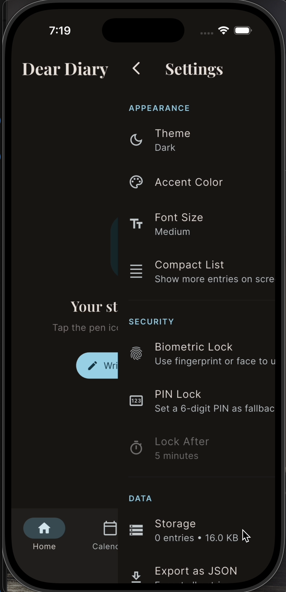

# Day Script 📔

A beautiful, secure, and feature-rich personal diary application built with Flutter. Capture your daily thoughts, emotions, and memories in an elegant interface designed for seamless journaling.

## ✨ Features

- **Rich Text Editing** — Write beautiful journal entries with text formatting, emojis, and rich content
- **Mood Tracking** — Track your emotional state with intuitive mood selection (None, Happy, Sad, Angry, Calm, Excited)
- **Photo Integration** — Add and crop photos directly from your entries with image cropping capabilities
- **Smart Search** — Quickly find past entries with powerful search functionality
- **Calendar View** — Browse your entries by date with an interactive calendar
- **Favorites** — Mark important entries as favorites for quick access
- **Auto-Save** — Your work is automatically saved every 30 seconds
- **Tagging System** — Organize entries with custom tags
- **Location Support** — Record the location where you wrote each entry
- **Dark/Light Theme** — Beautiful UI that adapts to your system theme
- **Security** — Biometric authentication (fingerprint/face recognition) to protect your privacy
- **Encrypted Storage** — Local database with encryption for sensitive entries
- **Responsive Design** — Seamless experience on phones and tablets

## 🎨 State Management

<div align="center">
  
  
</div>

The app uses **Flutter Riverpod** for efficient state management, providing:

- Reactive data flow with providers
- Automatic state invalidation and rebuilding
- Separation of concerns between UI and business logic
- Easy testing with dependency injection

## 🎬 Animations

<div align="center">
  
  
  
</div>

Smooth and delightful animations throughout the app:

- **Hero Animations** — Title animations when navigating between entries
- **Scroll-Aware FAB** — Floating action button that expands/collapses on scroll
- **Fade Transitions** — Elegant transitions between screens
- **AnimatedSwitcher** — Smooth widget transitions for state changes

## 📱 Responsive Design

<div align="center">
  
  
  
  
</div>

Fully responsive interface that adapts perfectly to any screen size:

- Mobile-optimized navigation with bottom navigation bar
- Tablet-friendly layouts for larger screens
- Flexible grid layouts
- Touch-friendly controls

## 🛠️ Tech Stack

### State Management & Reactive Programming

- **Flutter Riverpod** (^2.6.1) — Modern state management solution
- **Flutter Hooks** (^0.20.5) — Hook-based widget composition
- **Hooks Riverpod** (^2.6.1) — Integration of hooks with Riverpod

### Navigation

- **GoRouter** (^14.8.1) — Declarative routing with type safety

### Database & Storage

- **Isar** (^3.1.0+1) — Fast local database for Flutter
- **Flutter Secure Storage** (^9.2.4) — Secure key-value storage

### Rich Content

- **Flutter Quill** (^11.1.0) — Rich text editor

### Media & Image Handling

- **Image Picker** (^1.1.2) — Select images from gallery/camera
- **Image Cropper** (^8.0.2) — Crop images with intuitive UI

### Security & Authentication

- **Local Auth** (^2.3.0) — Biometric and local device authentication
- **Crypto** (^3.0.6) — Encryption for sensitive data

### UI & Design

- **Google Fonts** (^6.2.1) — Beautiful typography
- **Lottie** (^3.3.1) — High-quality animations
- **Table Calendar** (^3.2.0) — Interactive calendar widget
- **Material 3** — Modern Material Design

### Utilities

- **Intl** (^0.20.2) — Internationalization and date formatting
- **Path Provider** (^2.1.5) — File system path handling
- **Share Plus** (^10.1.4) — Share entries with friends
- **UUID** (^4.5.1) — Unique identifier generation

## 🚀 Getting Started

### Prerequisites

- Flutter SDK: 3.11.4 or higher
- Dart SDK: 3.11.4 or higher

### Installation

1. **Clone the repository**

   ```bash
   git clone <repository-url>
   cd day_script
   ```

2. **Install dependencies**

   ```bash
   flutter pub get
   ```

3. **Build Isar database (required)**

   ```bash
   dart run build_runner build
   ```

4. **Run the app**
   ```bash
   flutter run
   ```

### Platform-Specific Setup

#### iOS

```bash
cd ios
pod install
cd ..
flutter run
```

#### Android

No additional setup required. Ensure you have Android SDK 21 or higher.

## 📁 Project Structure

```
lib/
├── main.dart                 # App entry point
├── app.dart                  # App configuration
├── core/
│   ├── constants/            # App constants
│   ├── router/               # GoRouter configuration
│   ├── theme/                # Theme definitions
│   └── utils/                # Utility functions & extensions
├── data/
│   ├── models/               # Data models
│   ├── repositories/         # Data access layer
│   └── services/             # External services
├── providers/                # Riverpod providers
├── screens/                  # App screens
│   ├── home_screen.dart
│   ├── entry_detail_screen.dart
│   ├── entry_editor_screen.dart
│   ├── calendar_screen.dart
│   ├── search_screen.dart
│   ├── settings_screen.dart
│   ├── lock_screen.dart
│   └── splash_screen.dart
└── widgets/                  # Reusable widgets
    ├── entry_card.dart
    ├── mood_picker.dart
    ├── empty_state.dart
    └── ...
```

## 📝 Key Features Explained

### State Management with Riverpod

- **Providers** manage diary entries, search results, and UI state
- **Watch** mechanism rebuilds widgets when data changes
- **Invalidation** ensures data consistency across the app

### Rich Text Editing

The app uses Flutter Quill for rich text editing, supporting:

- Text formatting (bold, italic, underline)
- Headers and lists
- Emoji insertion
- Link handling

### Smart Search

- Full-text search across entry titles and content
- Filter by date range
- Quick access to frequently searched entries

### Mood Tracking & Analytics

- Visual mood indicators with emoji representations
- Color-coded entries based on mood
- Mood statistics and trends

### Biometric Security

- Fingerprint authentication on Android
- Face ID/Touch ID authentication on iOS
- Secure storage of sensitive data

### Data Persistence

- Local Isar database for fast, offline-first experience
- Automatic backup capabilities
- Encrypted storage option

## 🎯 Development Workflow

### Running Tests

```bash
flutter test
```

### Building APK (Android)

```bash
flutter build apk --release
```

### Building IPA (iOS)

```bash
flutter build ios --release
```

### Code Generation

The app uses `build_runner` for code generation:

```bash
dart run build_runner build --delete-conflicting-outputs
```

## 🐛 Known Issues & Fixes

- **Hero Tag Conflicts**: Resolved by using `AnimatedSwitcher` for FAB transitions and ensuring unique hero tags
- **Platform-Specific Image Handling**: Tested on both iOS and Android with proper error handling

## 📱 Device Compatibility

- **Android**: 5.0 (API 21) and higher
- **iOS**: 11.0 and higher
- **Web**: Supported (partial feature support)

## 🎨 Design Philosophy

Day Script follows Material Design 3 principles with:

- Clean, minimal interface
- Focus on readability
- Thoughtful use of whitespace
- Accessible color contrasts
- Smooth animations and transitions

## 📄 License

This project is proprietary. All rights reserved.

## 🤝 Contributing

Contributions, issues, and feature requests are welcome!

## 📞 Support

For issues or questions, please open an issue on the repository.

---

**Day Script** — Capture your story, one entry at a time. ✍️
