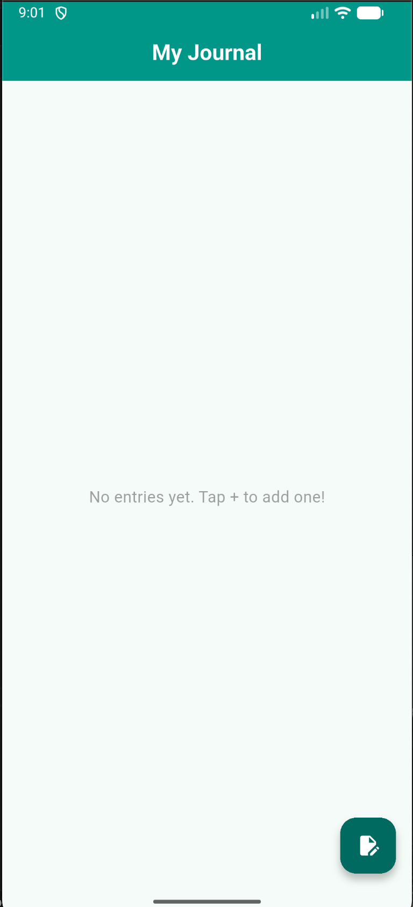
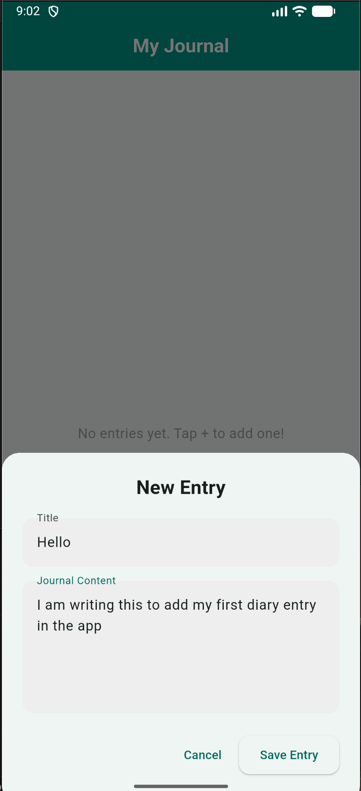
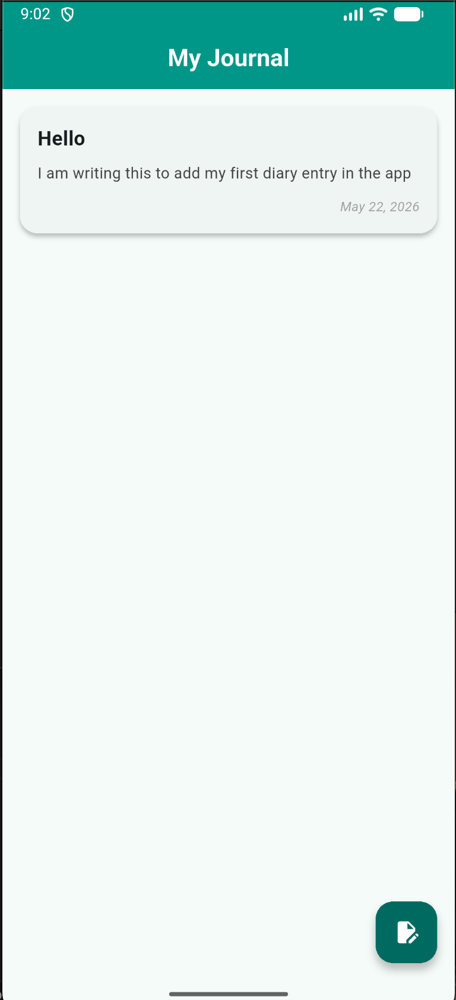

# Journal App

A simple Flutter journal app where users can create, save and view text entries.

## Features

- Create and save journal entries.
- View a list of entries on the home screen.
- Simple, focused UI suitable as a lightweight diary.

## Screenshots

<p>



</p>

## Getting started

Prerequisites:

- Flutter SDK installed (see https://docs.flutter.dev).
- A device or emulator to run the app.

Install and run:

```bash
flutter pub get
flutter run
```

For dependency details, see [pubspec.yaml](pubspec.yaml).

## Project layout

- `lib/` — main app code (screens, models, widgets).
- `assets/` — screenshots and other static assets used by the app.
- `android/`, `ios/`, `web/`, `linux/`, `macos/`, `windows/` — platform folders.

## Notes

- This README uses the screenshots stored in the `assets/` folder. If your
  screenshot filenames differ, update the image paths above accordingly.
- To build a release version, run `flutter build apk` or `flutter build ios`.

If you want, I can also:

- Add more detailed developer notes or architecture overview.
- Create CONTRIBUTING or CHANGELOG files.

---

Updated README for the Journal App.
