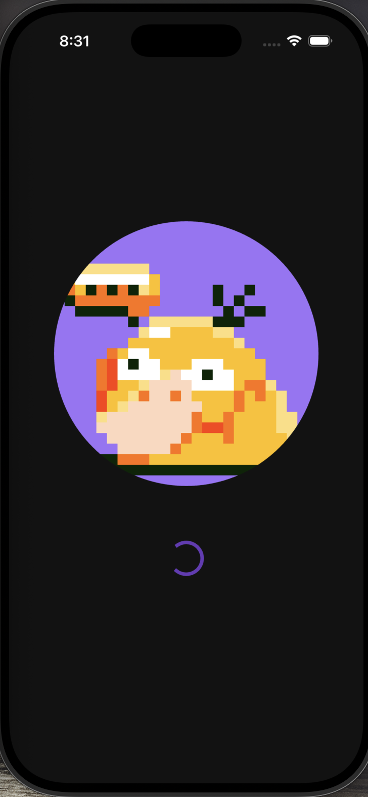
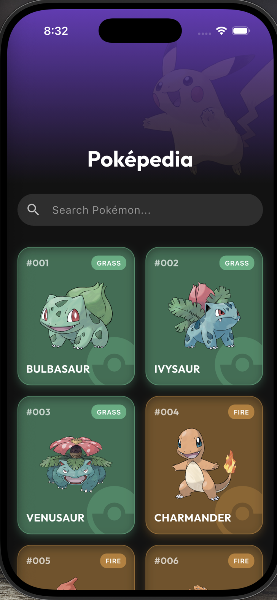

# Pokepedia

A simple and elegant Pokedex application built with Flutter. Browse and explore information about various Pokémon with a beautiful user interface.

## Features

- 📱 Browse Pokémon database
- 🖼️ View Pokémon images and details
- 🎨 Clean and intuitive user interface
- ⚡ Smooth and responsive performance
- 📊 Display Pokémon statistics and information

## Screenshots

<p align="center">
  
  
  
</p>

## Prerequisites

Before you begin, ensure you have the following installed:

- [Flutter](https://flutter.dev/docs/get-started/install) (SDK version 3.10.8 or higher)
- [Dart](https://dart.dev/get-dart) (comes with Flutter)
- A code editor (VS Code, Android Studio, or IntelliJ IDEA)

## Installation

1. **Clone or navigate to the project directory:**

   ```bash
   cd pokepedia
   ```

2. **Get dependencies:**

   ```bash
   flutter pub get
   ```

3. **Run the application:**
   ```bash
   flutter run
   ```

## Project Structure

```
pokepedia/
├── lib/               # Application source code
│   ├── main.dart      # App entry point
│   ├── app.dart       # App configuration
│   └── ...
├── assets/            # App assets
│   ├── images/        # Pokémon images and icons
│   └── ...
├── android/           # Android platform code
├── ios/               # iOS platform code
├── web/               # Web platform code
├── linux/             # Linux platform code
├── macos/             # macOS platform code
├── windows/           # Windows platform code
└── pubspec.yaml       # Project dependencies and metadata
```

## Getting Started

To get started with development:

1. Open the project in your preferred IDE
2. Run `flutter pub get` to fetch dependencies
3. Use `flutter run` to launch the app on your device or emulator
4. Check `lib/main.dart` for the app entry point

## Building

### Android

```bash
flutter build apk
# or
flutter build appbundle
```

### iOS

```bash
flutter build ios
```

### Web

```bash
flutter build web
```

### Desktop (Windows, macOS, Linux)

```bash
flutter build windows    # For Windows
flutter build macos      # For macOS
flutter build linux      # For Linux
```

## Resources

- [Flutter Documentation](https://docs.flutter.dev/)
- [Dart Documentation](https://dart.dev/guides)
- [Flutter Cookbook](https://docs.flutter.dev/cookbook)
- [Official Flutter Lab](https://docs.flutter.dev/get-started/codelab)

## License

This project is open source and available under the MIT License.

## Contributing

Contributions are welcome! Feel free to submit a pull request or open an issue for any bugs or feature requests.
