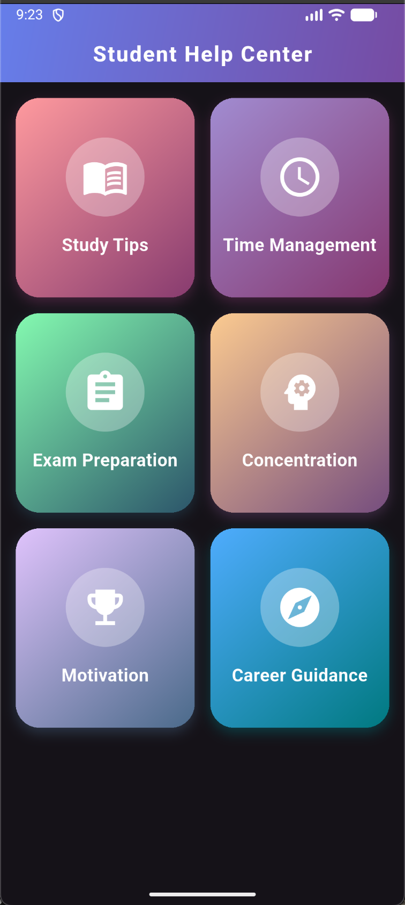
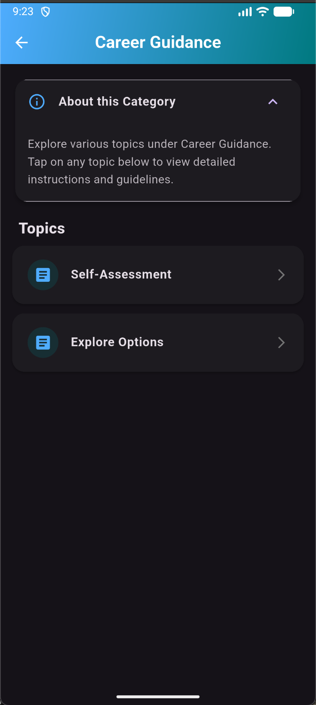
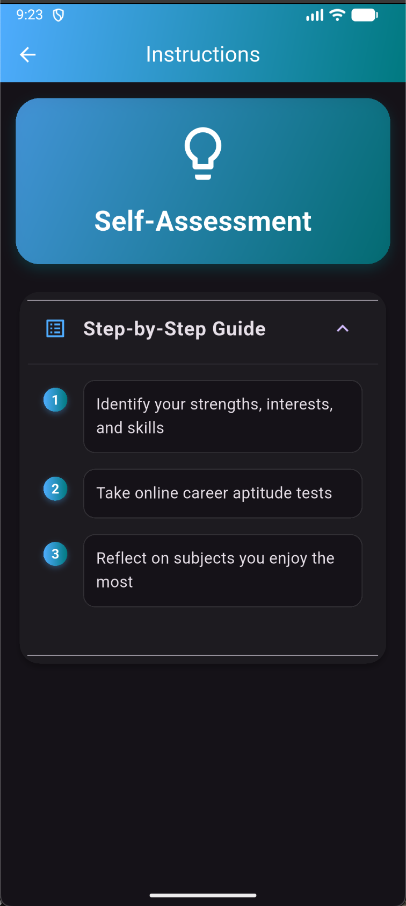

**Student Help**

A small Flutter app that provides quick help and topic navigation for students. Images used by the app are included in the `assets/` folder and displayed below.

**Features**

- **Simple UI:**: Clean, minimal screens for category and topic navigation.
- **Assets:**: App images are stored in the `assets/` folder and referenced from `pubspec.yaml`.

**Setup**

- **Flutter SDK:**: Ensure Flutter is installed and on your `PATH`.
- **Dependencies:**: See [pubspec.yaml](pubspec.yaml) for packages and versions.

**Run locally**

1. Fetch packages:

```bash
flutter pub get
```

2. Run the app on a connected device or simulator:

```bash
flutter run
```

**Assets / Screenshots**
Below are the app images included in the `assets/` folder displayed in a single row for quick preview.

<div style="display:flex;gap:12px;align-items:center;flex-wrap:nowrap">
  
  
  
</div>

**Project Structure (important files)**

- **`lib/`**: App source code (screens, models). Start at `lib/main.dart`.
- **`assets/`**: Images and other static assets used by the app.
- **`pubspec.yaml`**: Dependency and asset configuration ([pubspec.yaml](pubspec.yaml)).

**Notes**

- If images don't show in the README preview on some renderers, view them in the running app or open the files directly from the `assets/` folder.

If you'd like, I can also add a small screenshot gallery page inside the app or update `pubspec.yaml` to ensure the assets are declared explicitly.

# student_help

A new Flutter project.

## Getting Started

This project is a starting point for a Flutter application.

A few resources to get you started if this is your first Flutter project:

- [Learn Flutter](https://docs.flutter.dev/get-started/learn-flutter)
- [Write your first Flutter app](https://docs.flutter.dev/get-started/codelab)
- [Flutter learning resources](https://docs.flutter.dev/reference/learning-resources)

For help getting started with Flutter development, view the
[online documentation](https://docs.flutter.dev/), which offers tutorials,
samples, guidance on mobile development, and a full API reference.
