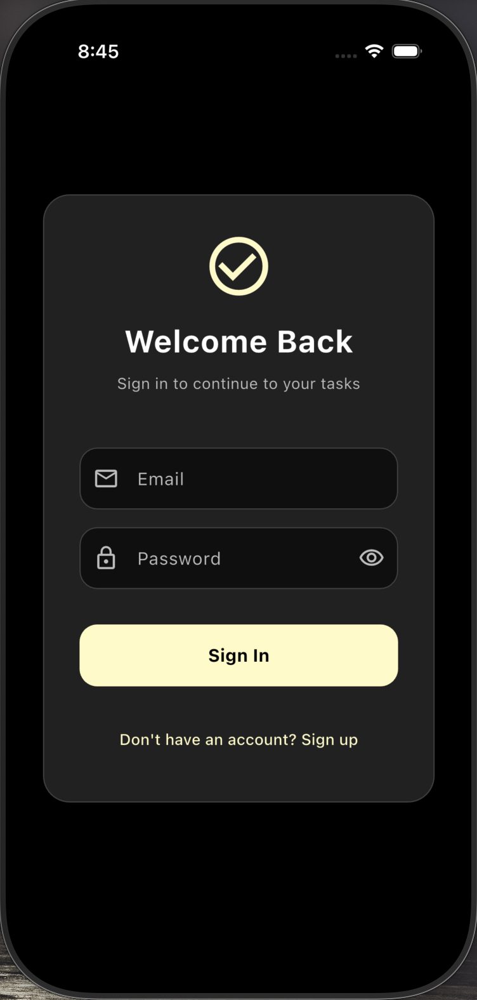
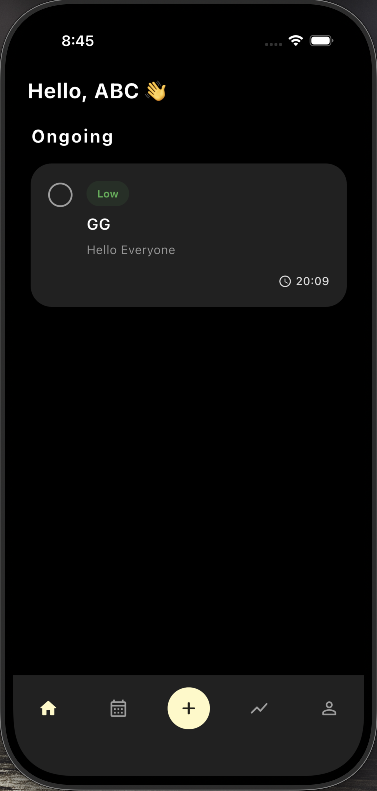
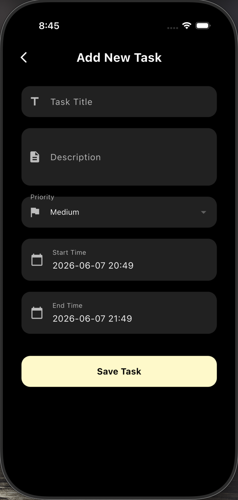
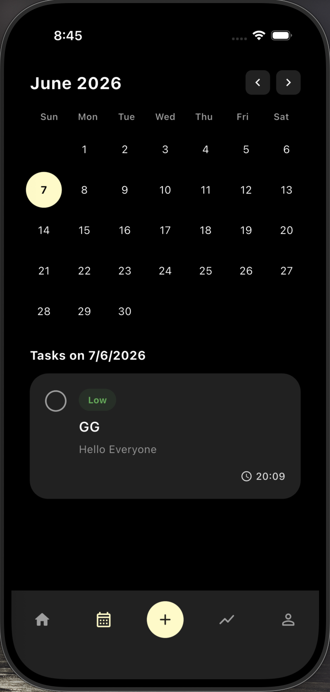
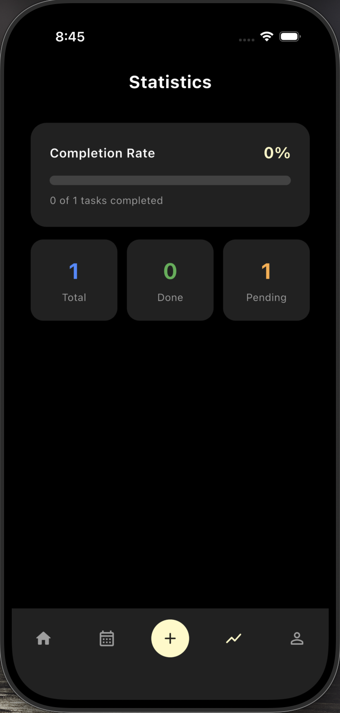
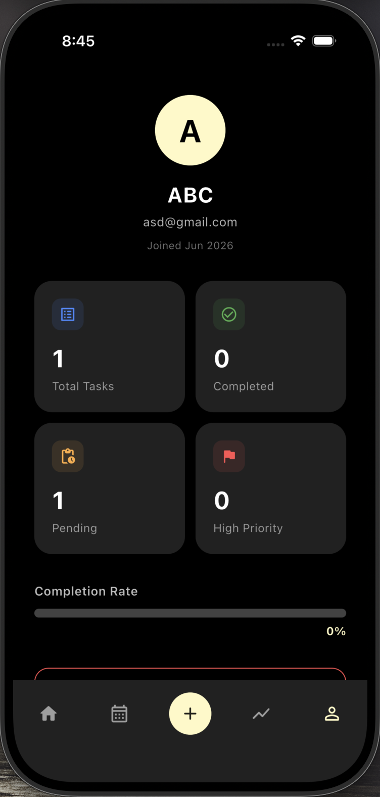

# 📝 Todo App

A beautifully designed, full-featured task management app built with **Flutter** and powered by **Firebase** — featuring real-time sync, authentication, a calendar view, statistics, and a clean dark-theme UI.

---

## 📸 Screenshots

<table>
  <tr>
    <td align="center"><b>Login</b></td>
    <td align="center"><b>Home</b></td>
    <td align="center"><b>Add Task</b></td>
  </tr>
  <tr>
    <td></td>
    <td></td>
    <td></td>
  </tr>
  <tr>
    <td align="center"><b>Calendar</b></td>
    <td align="center"><b>Statistics</b></td>
    <td align="center"><b>Profile</b></td>
  </tr>
  <tr>
    <td></td>
    <td></td>
    <td></td>
  </tr>
</table>

---

## ✨ Features

- 🔐 **Firebase Authentication** — Secure email/password sign-in and sign-up
- 🔥 **Firestore Real-time Sync** — Tasks update live across sessions
- ✅ **Task Management** — Create tasks with title, description, priority, start & end time
- 🎯 **Priority Levels** — High, Medium, and Low with color-coded badges
- 🗓️ **Calendar View** — Browse tasks by date with dot indicators on busy days
- 📊 **Statistics Screen** — Completion rate, total, done, and pending task counts
- 👤 **Profile Screen** — User info, task stats, and sign-out
- 🌙 **Dark Theme** — Consistent dark UI with yellow accent throughout

---

## 🛠️ Tech Stack

| Technology             | Purpose                     |
| ---------------------- | --------------------------- |
| **Flutter** (Dart)     | Cross-platform UI framework |
| **Firebase Auth**      | User authentication         |
| **Cloud Firestore**    | Real-time NoSQL database    |
| **Flutter Riverpod**   | State management            |
| **Shared Preferences** | Local data persistence      |

---

## 📁 Project Structure

```
lib/
├── main.dart                    # App entry point
├── Models/
│   ├── todo_model.dart          # Task data model
│   └── user_model.dart          # User data model
├── providers/
│   ├── auth_provider.dart       # Auth state providers
│   └── todo_provider.dart       # Todo stream & service providers
├── screens/
│   ├── auth_wrapper.dart        # Auth gate (login vs home)
│   ├── home_screen.dart         # Main scaffold with bottom nav
│   ├── add_form.dart            # Add task form
│   ├── calendar_screen.dart     # Calendar with task view
│   ├── stats_screen.dart        # Statistics overview
│   └── profile_screen.dart      # User profile & logout
├── services/
│   ├── auth_service.dart        # Firebase Auth operations
│   └── todo_service.dart        # Firestore CRUD operations
└── widgets/
    └── task_card.dart           # Reusable task card widget
```

---

## 🚀 Getting Started

### Prerequisites

- [Flutter SDK](https://docs.flutter.dev/get-started/install) (Dart SDK `^3.11.4`)
- A [Firebase project](https://console.firebase.google.com/) with:
  - **Authentication** (Email/Password) enabled
  - **Cloud Firestore** database created

### Installation

1. **Clone the repository**

   ```bash
   git clone https://github.com/your-username/todo_app.git
   cd todo_app
   ```

2. **Install dependencies**

   ```bash
   flutter pub get
   ```

3. **Connect Firebase**

   Use the [FlutterFire CLI](https://firebase.flutter.dev/docs/cli/) to set up Firebase for your platforms:

   ```bash
   dart pub global activate flutterfire_cli
   flutterfire configure
   ```

   This generates the required `firebase_options.dart` file.

4. **Run the app**
   ```bash
   flutter run
   ```

---

## 📦 Dependencies

```yaml
dependencies:
  firebase_core: ^4.10.0
  firebase_auth: ^6.5.2
  cloud_firestore: ^6.5.0
  flutter_riverpod: ^3.3.1
  shared_preferences: ^2.5.5
  cupertino_icons: ^1.0.8
```

---

## 🗄️ Firestore Data Model

**Collection:** `todos`

| Field         | Type        | Description                      |
| ------------- | ----------- | -------------------------------- |
| `userId`      | `String`    | Owner's Firebase UID             |
| `taskname`    | `String`    | Task title                       |
| `description` | `String`    | Task description                 |
| `startDate`   | `Timestamp` | Task start date & time           |
| `endDate`     | `Timestamp` | Task end date & time             |
| `priority`    | `String`    | `"high"`, `"medium"`, or `"low"` |
| `isCompleted` | `bool`      | Completion status                |

**Collection:** `users`

| Field       | Type        | Description           |
| ----------- | ----------- | --------------------- |
| `name`      | `String`    | Display name          |
| `email`     | `String`    | Email address         |
| `createdAt` | `Timestamp` | Account creation date |

---

## 📄 License

This project is open-source and available under the [MIT License](LICENSE).
